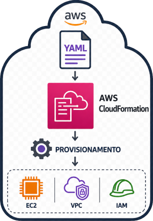
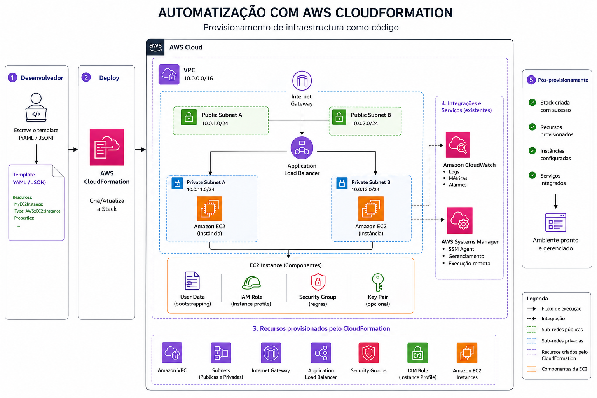

# AWS_CloudFormation_Automatização

 &nbsp; &nbsp; &nbsp; &nbsp; Projeto que visa revisar conhecimentos práticos em AWS CloudFormation e como utilizar stacks e provisionar de forma eficiente.

## O que é o AWS CloudFormation ##

&nbsp; &nbsp; &nbsp; &nbsp;  O AWS CloudFormation é um serviço que permite definir toda a infraestrutura de uma aplicação por meio de modelos declarativos, geralmente escritos em YAML ou JSON. Esses modelos descrevem recursos como instâncias EC2, buckets S3, bancos de dados RDS, funções Lambda, redes VPC e muito mais.
Em vez de criar cada recurso manualmente no console da AWS, o CloudFormation automatiza a criação, atualização e exclusão de componentes de forma controlada, repetível e versionável.  

## Implementando Infraestrutura Automatizada com AWS CloudFormation ##

&nbsp; &nbsp; &nbsp; &nbsp;  A automação de infraestrutura é um dos pilares da computação em nuvem moderna, permitindo que empresas criem, configurem e gerenciem recursos de forma padronizada, rápida e segura. Dentro do ecossistema da Amazon Web Services (AWS), a ferramenta AWS CloudFormation desempenha um papel essencial nesse processo, possibilitando a implementação de infraestrutura como código (IaC).

## Vantagens da Automação com CloudFormation ##

- Padronização e consistência: todos os ambientes (produção, teste e desenvolvimento) podem ser criados com a mesma configuração, evitando erros humanos.

- Escalabilidade e repetibilidade: a infraestrutura pode ser replicada quantas vezes for necessário, garantindo agilidade em novos projetos.

- Controle de versão: os templates podem ser armazenados em repositórios Git, permitindo rastrear mudanças e aplicar práticas DevOps.

- Integração com outros serviços AWS: o CloudFormation pode ser combinado com AWS CodePipeline, AWS Lambda e AWS Systems Manager para formar pipelines de CI/CD automatizados.

## Como funciona o processo ##

- Criação do Template: o desenvolvedor define o modelo declarando todos os recursos necessários e suas dependências.

- Implantação do Stack: o CloudFormation lê o template e cria um stack (pilha), que representa a coleção de recursos implantados.

- Gerenciamento Automatizado: o serviço provisiona, configura e monitora os recursos automaticamente. Qualquer atualização é feita através da modificação do template e aplicação controlada da mudança.

- Rollback Automático: em caso de falha durante a implantação, o CloudFormation reverte as alterações para manter a integridade da infraestrutura.

  ### Exemplo ###

## Boas Práticas ##

- Usar parâmetros e variáveis para tornar os templates reutilizáveis.

- Empregar outputs para expor informações úteis, como URLs e IDs de recursos.

- Dividir a infraestrutura em stacks aninhados para facilitar o gerenciamento modular.

- Integrar o CloudFormation com AWS Config e IAM para reforçar segurança e conformidade.

## Conclusão ##

&nbsp; &nbsp; &nbsp; &nbsp;  A implementação de infraestrutura automatizada com AWS CloudFormation representa um avanço significativo na gestão de ambientes em nuvem. Ao tratar a infraestrutura como código, as organizações ganham agilidade, segurança e previsibilidade, além de reduzir custos e falhas operacionais.
Com essa abordagem, equipes de TI e DevOps conseguem concentrar esforços na inovação e na entrega de valor, enquanto a infraestrutura é criada e gerenciada de forma confiável e automatizada.
